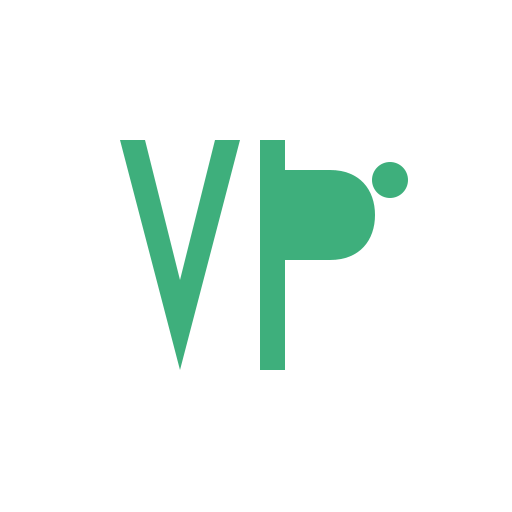

  <!-- 上传logo.svg到profile目录后启用 -->
   

<h1 align="center">AI VP</h1>

  
  
  

  <em>AI Knowledge · Prompt Library · Docs Powered by VuePress & VitePress</em>

  <a href="https://github.com/Models-AI">Companion Organization: Models-AI</a>

---

## 🧩 About AI VP
AI VP is an open-source community focused on AI technical documentation, prompt engineering, LLM notes, and AI agent workflow tutorials.

We build knowledge websites using **VuePress and VitePress**, collect reusable prompt templates, and share practical tutorials for large language models and intelligent agents.

## 📂 What we maintain
- 📖 AI technical knowledge base & personal notes
- 📝 Prompt engineering template library
- 🤖 AI Agent workflow examples & demos
- 🎨 VuePress / VitePress themes and site templates

## 📦 Main Repositories
| Repository | Description |
| ---- | ---- |
| [`ai-vp/docs`](https://github.com/ai-vp/docs) | AI Knowledge Base Website |
| [`ai-vp/prompts`](https://github.com/ai-vp/prompts) | Prompt Template Library |
| [`ai-vp/themes`](https://github.com/ai-vp/themes) | VuePress & VitePress Themes |

## 🔗 Companion Organization
**[Models-AI](https://github.com/Models-AI)**
> LLM scripts, model tests, model evaluations and model demos.

## ✨ How to contribute
Anyone is welcome to participate:
- Fix typos, broken links and content errors
- Submit high-quality prompt templates
- Add AI tutorials and knowledge articles
- Share VitePress / VuePress theme demos

All contents are released under the MIT License.

---

## 关于 AI VP
AI VP 是开源AI文库社区，专注AI技术文档、提示词工程、大模型笔记与AI智能体工作流教程。
我们基于 VuePress、VitePress 搭建知识库站点，整理可复用提示词模板，分享大模型与智能体实战教程。

配套组织 **Models-AI**：存放大模型脚本、模型测试、模型评测相关项目。

### 欢迎参与贡献
修正文档笔误、提交优质提示词、新增AI技术文章、分享VuePress/VitePress主题模板。

项目全部内容采用 MIT 协议开源。

