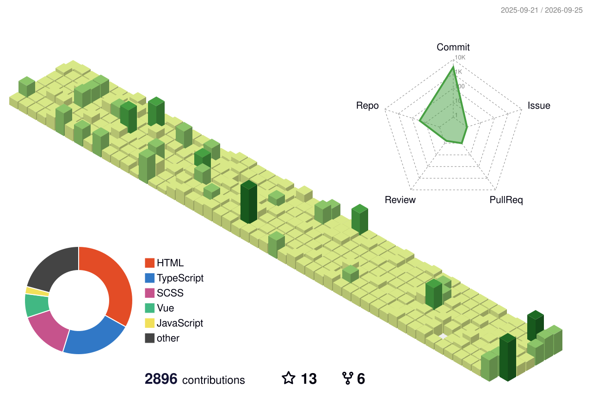

# AI-VP 技术组织

> 专注前端、VitePress文档站、工程化与DevOps实践，沉淀体系化技术知识库。

## 📖 关于本组织
持续整理碎片化、结构化的技术笔记，记录学习与踩坑经验，分享开源实践。

## 📂 仓库目录
- 技术知识库：VitePress搭建的在线文档站点
- GitHub自动化：GitHub Actions、CI/CD相关示例与模板
- 前端工程化：Vite、PNPM、Monorepo、包管理相关实践

## 🧑‍💻 内容方向
- VitePress 文档网站搭建、多语言配置
- Git / GitHub Actions 自动化部署
- 前端工程化、NodeJS、包管理
- 网络、代理、服务器运维笔记

## 💡 参与方式
有疑问或者建议，欢迎提交 Issues 交流讨论。

